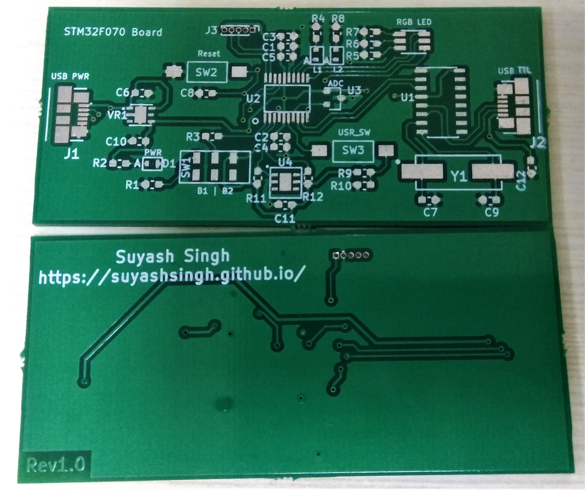

# Hardware Board Design for STM32F070F6
`STM32F070F6` is a 32-bit ARM Cortex-M0 microcontroller from ST. This repository contains the hardware files needed for creating a basic board for working with this micro controller. 

EDA Tool: **KiCad(5.0.1)**.

**Many thanks to [Balram](https://www.linkedin.com/in/balram-jatav/) for helping me out with the PCB design :slightly_smiling_face:**

## Images 
1. Real Board - before assembly

2. 3D View of the Board

3. Fab House Front Copper Layer

4. Board Front Copper Layer

## Board Bring Up Checklist
- [x] 1. Change trace width of power tracks
- [x] 2. Merge `dev` branch to master
- [x] 3. Export gerbers - research about fab houses
- [x] 4. Verify gerbers
- [x] 5. Send board to fab house
- [x] 6. Generate BOM
- [x] 7. Order component and tools

## Timeline
| Event                         | Date          |
| ----------------------------- | ------------- |
| Project Start                 | 12 Sep 2019   |
| Schematic Complete            | 5th Oct 2019  |
| Layout Complete               | 6th Oct 2019  |
| Sent gerbers for fabrication  | 3rd Dec 2019  |
| Received PCB's from fab house | 11th Dec 2019 |
| BOM Complete                  | 17th Dec 2019 |
| Ordered Components & Tools    | 17th Dec 2019 |

## Notes
1. Changed the switches with were earlier decided from *robu.in* to [this](https://in.element14.com/alcoswitch-te-connectivity/fsmsm/switch-spst-0-05a-24vdc-smd/dp/1703878) from element14, as mechanical dimensions were not available.

2. Links that might be useful for usb connector:
	+ [Element 14 Page](https://in.element14.com/molex/47346-0001/usb-conn-2-0-micro-usb-type-b/dp/1568026?st=mirco%20usb%20connector)
	+ [Digi Key Kicad Library](https://github.com/Digi-Key/digikey-kicad-library/tree/master/) - Search for MPN
	+ [Mouser](https://www.mouser.in/ProductDetail/Molex/47346-0001?qs=c2CV6XM0DweJBWaSeyWeCw%3D%3D)

3. Always do a board check when you receive the board from the fab house. You can do:
	
	a. Visual Inspection
	
	b. Check for short between the power rails - This board has 3V3 and 5V power rails. Thanks to Balram for pointing out this.

