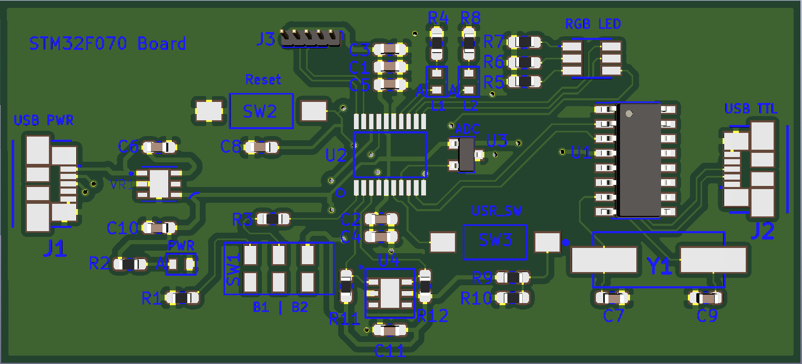
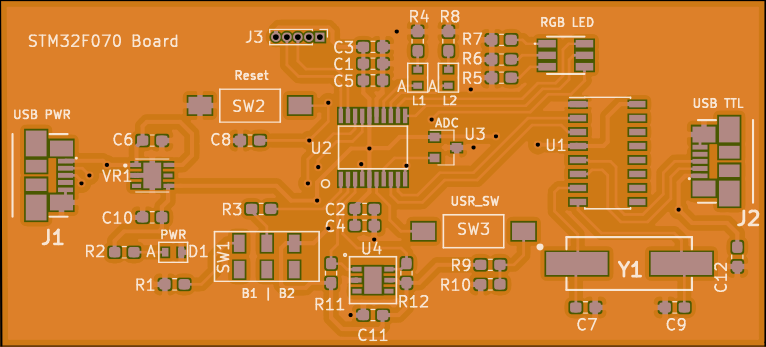
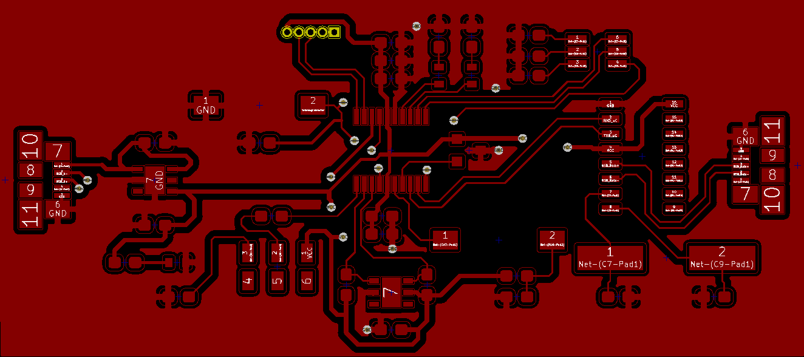

# Hardware Board Design for STM32F070F6
`STM32F070F6` is a 32-bit ARM Cortex-M0 microcontroller from ST. This repository contains the hardware files needed for creating a basic board for working with this micro controller. 

EDA Tool: **KiCad(5.0.1)**.

**Many thanks to [Balram](https://www.linkedin.com/in/balram-jatav-0a6467114/) for helping me out with the PCB design :slightly_smiling_face:**

## Images
1. 3D View of the Board

2. Fab House Front Copper Layer

3. Board Front Copper Layer

## Board Bring Up Checklist
- [x] 1. Change trace width of power tracks
- [x] 2. Merge `dev` branch to master
- [x] 3. Export gerbers - research about fab houses
- [x] 4. Verify gerbers
- [x] 5. Send board to fab house
- [ ] 6. Generate BOM
- [ ] 7. Order component and tools
- [ ] 8. Take actual size prints(of PCB) and roam in local component market.
- [ ] 9. Populate and verify the power section
- [ ] 10. Verify power to all sections, ics, etc.
- [ ] 11. Populate uC and required components
- [ ] 12. Verify uC with debugger
- [ ] 13. Populate leds, switches, etc.
- [ ] 14. Verify UART comes up as a COM port (use a raspberry pi)
- [ ] 15. Check uC is switching clock to crystal - crystal faults
- [ ] 16. Test user leds and switches
- [ ] 17. Test RGB led
- [ ] 18. Test I2C temp sensor
- [ ] 19. Test UART for data TX and RX
- [ ] 20. Board bring up complete. Party :sunglasses:

## Timeline
| Event                        | Date         |
|------------------------------|--------------|
| Project Start                | 12 Sep 2019  |
| Schematic Complete           | 5th Oct 2019 |
| Layout Complete              | 6th Oct 2019 |
| Sent gerbers for fabrication | 3rd Dec 2019 |

## Notes
1. Changed the switches with were earlier decieded from *robu.in* to [this](https://in.element14.com/alcoswitch-te-connectivity/fsmsm/switch-spst-0-05a-24vdc-smd/dp/1703878) from element14, as mechanical dimentions were not available.

2. Links that might be useful for usb connector:
	+ [Element 14 Page](https://in.element14.com/molex/47346-0001/usb-conn-2-0-micro-usb-type-b/dp/1568026?st=mirco%20usb%20connector)
	+ [Digi Key Kicad Library](https://github.com/Digi-Key/digikey-kicad-library/tree/master/) - Search for MPN
	+ [Mouser](https://www.mouser.in/ProductDetail/Molex/47346-0001?qs=c2CV6XM0DweJBWaSeyWeCw%3D%3D)
